```mermaid
graph TD
    subgraph A [战略与治理层]
        A1[服务级别管理<br/>SLM]
    end

    subgraph B [运营执行层]
        B1[服务报告]
        
        subgraph B2 [服务支持流程链]
            direction LR
            B2_1[事件管理] --> B2_2[问题管理] --> B2_3[变更管理] --> B2_4[发布管理]
        end
        
        B3[容量管理]
        B4[配置管理<br/>CMDB]
        B5[服务可用性与<br/>连续性管理]
    end

    subgraph C [基础与合规层]
        C1[信息安全管理制度<br/>贯穿所有层面]
    end

    %% 核心驱动与反馈
    A1 -->|设定目标与标准| B
    B1 -->|反馈绩效数据| A1
    
    %% 运营层内部协同
    B2_1 --> B4
    B2_2 --> B4
    B2_3 --> B4
    B2_4 -->|更新| B4
    
    B3 -->|容量需求| B2_3
    B5 -->|可用性需求| B2_3
    
    B4 -->|提供配置数据| B2_1
    B4 -->|提供配置数据| B2_2
    B4 -->|提供配置数据| B5
    B4 -->|提供配置数据| B3
    
    %% 信息安全贯穿
    C1 -.->|安全管控| A1
    C1 -.->|安全管控| B
```

### **设计图核心逻辑注解**

1.  **三层驱动架构**
    *   **顶层（战略）**：**服务级别管理（SLM）** 是引擎，定义服务目标（SLA）并驱动整个体系运作。
    *   **中层（运营）**：所有日常执行过程在此层。它们接收顶层目标，并将绩效数据通过 **服务报告** 反馈至顶层，形成 **“设定-执行-反馈-改进”** 的治理闭环。
    *   **底层（基础）**：**信息安全管理制度** 是基石，为所有上层活动提供策略、控制和合规性保障，是横向贯穿的核心要素。

2.  **双流协同机制**
    *   **纵向管控流**：体现为顶层对中层的目标驱动，以及中层向顶层的绩效反馈。**服务报告** 是此流的关键枢纽。
    *   **横向业务流**：体现为 **“事件→问题→变更→发布”** 的核心服务支持流程链。该链旨在高效解决故障、根除问题并安全实施变更。

3.  **两个核心枢纽**
    *   **配置管理（CMDB）**：作为 **“单一可信数据源”**，为几乎所有流程提供准确的配置项及关系数据，是流程协同和信息一致性的基础。
    *   **变更管理**：作为 **“风险控制阀门”**，是流程链中的关键决策点。来自容量、可用性等流程的改进需求，最终都需经此流程评估和授权，确保业务稳定。

4.  **保障性流程的支撑作用**
    *   **容量管理** 与 **服务可用性和连续性管理** 属于主动性的服务设计/优化流程。它们通过监控、分析和预测，向变更管理提出优化需求，从而前瞻性地保障服务能力。

此框架图清晰地展示了ITSS各过程并非孤立存在，而是通过明确的接口和流程链，形成一个以服务战略为导向、以配置数据为基础、以安全为保障、持续改进的有机整体。您可直接将此逻辑用于PPT绘制或文档编制。